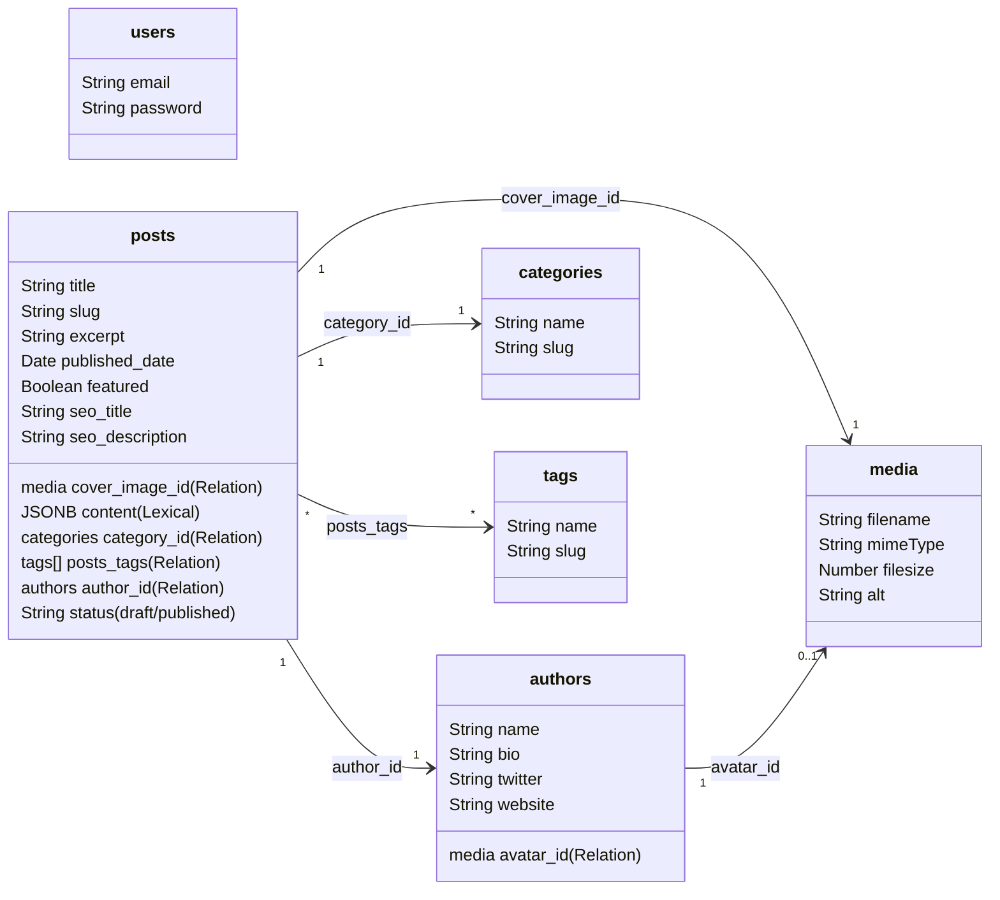

# PortsAI Blog Platform (blog.portsai.in)

This repository is an optimized, production-ready blog platform built for **PortsAI.in** to drive organic traffic. It features a visitor-facing frontend inspired by Medium's minimalist typography and a back-end powered by **Payload CMS 3.0** with **Supabase/PostgreSQL** database schemas.

---

## 🤖 AI Agent Reference & System Specifications

> [!NOTE]
> This section is formatted for coding assistants to quickly comprehend the codebase architecture and start executing tasks immediately.

### 🏛️ File & Layout Sitemap

- **Branding Styles:** [`src/app/(frontend)/styles.css`](file:///C:/Users/abdul/OneDrive/Desktop/Abdullah%20Aarif/blogwebsite/src/app/%28frontend%29/styles.css) (Tailwind CSS v4 imports, global design variables, amber-gold styling accents).
- **Core CMS Settings:** [`src/payload.config.ts`](file:///C:/Users/abdul/OneDrive/Desktop/Abdullah%20Aarif/blogwebsite/src/payload.config.ts) (PostgreSQL connection configuration, Lexical rich text configuration, collection registration, and importMap mapping).
- **Lexical AST Render Engine:** [`src/app/(frontend)/components/RichText.tsx`](file:///C:/Users/abdul/OneDrive/Desktop/Abdullah%20Aarif/blogwebsite/src/app/%28frontend%29/components/RichText.tsx) (Recursively renders Payload CMS 3.0 Lexical editor states into React elements, handling code blocks, blockquotes, lists, links, alignments, text styling bitmasks, and responsive image nodes).
- **Page Endpoints:**
  - `/` Landing Portal: [`src/app/(frontend)/page.tsx`](file:///C:/Users/abdul/OneDrive/Desktop/Abdullah%20Aarif/blogwebsite/src/app/%28frontend%29/page.tsx) (Featured posts, category lists, dynamic search parameter queries, and newsletter subscriptions).
  - `/blog` Listing Page: [`src/app/(frontend)/blog/page.tsx`](file:///C:/Users/abdul/OneDrive/Desktop/Abdullah%20Aarif/blogwebsite/src/app/%28frontend%29/blog/page.tsx) (Pagination offsets, category filters, search input queries).
  - `/blog/[slug]` Details: [`src/app/(frontend)/blog/[slug]/page.tsx`](file:///C:/Users/abdul/OneDrive/Desktop/Abdullah%20Aarif/blogwebsite/src/app/%28frontend%29/blog/%5Bslug%5D/page.tsx) (Dynamic metadata generation, read time calculations, related articles search, share link anchors, and Google structured data).
- **SEO Elements:**
  - Sitemap Generator: [`src/app/sitemap.ts`](file:///C:/Users/abdul/OneDrive/Desktop/Abdullah%20Aarif/blogwebsite/src/app/sitemap.ts) (Queries database for published posts and generates a real-time `sitemap.xml`).
  - Indexing Directives: [`src/app/robots.ts`](file:///C:/Users/abdul/OneDrive/Desktop/Abdullah%20Aarif/blogwebsite/src/app/robots.ts) (Disallows crawling on `/admin` paths).

---

## 🗄️ Database Schemas & Relations

Payload CMS utilizes a PostgreSQL adapter to synchronize schemas automatically.



---

## 🔧 Dev/Build Commands & Environment Diagnostics

> [!WARNING]
> On Windows PowerShell, executing global npm package binaries like `next` or `payload` can fail with `CommandNotFoundException` or script restrictions. Use Node-direct CLI commands instead.

### Local Development Execution (Port 3000)
To bypass Windows execution policies and shell issues, execute the Next.js binary directly using Node:
```bash
node node_modules/next/dist/bin/next dev
```

### TypeScript Definitions Compilation
If you add or update schemas in `./src/collections`, compile the matching type definitions (`src/payload-types.ts`) by running:
```bash
node node_modules/payload/bin.js generate:types
```

### Administrative Import Map Compilation
If you add custom React components or change collections, regenerate the admin panel module registry by running:
```bash
node node_modules/payload/bin.js generate:importmap
```

### Next.js Production Compilation
Build optimized assets (configured with `typescript: { ignoreBuildErrors: true }` in `next.config.ts` to skip generated validation warnings):
```bash
node node_modules/next/dist/bin/next build
```

---

## 💡 Resilience & Connection Troubleshooting

All pages have their database fetches wrapped in `try/catch` handlers. If the `getPayload` local API fails to establish a PostgreSQL pool connection:
1. It **prevents a fatal 500 server crash**.
2. It serves a custom diagnostic page instructing you on how to check your `DATABASE_URI` in `.env` and configure Supabase.
3. Once the database connection is resolved, the application instantly refreshes and renders the articles without requiring further changes.
